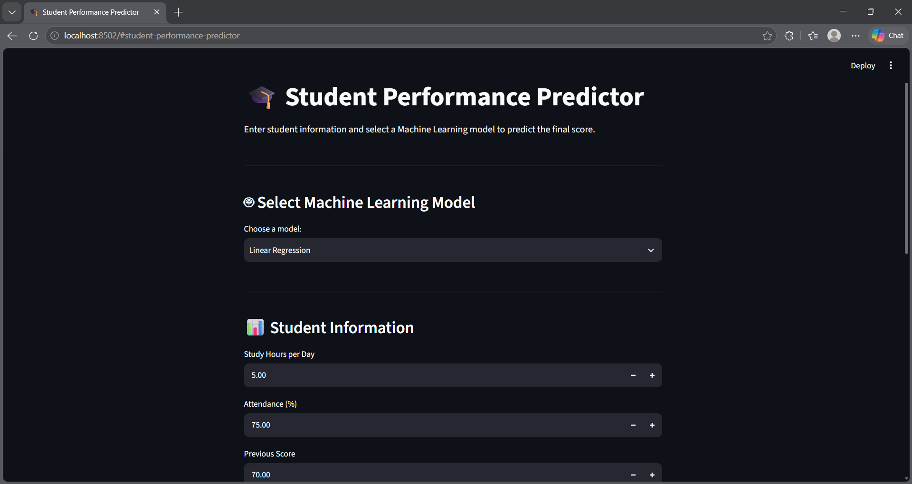

# 🎓 Student Performance Prediction

A Machine Learning project that predicts a student's final academic score based on study and academic-related factors.

## 📌 Project Overview

This project uses Machine Learning regression algorithms to predict a student's final score using features such as study hours, attendance, previous score, assignment score, sleep hours, and study sessions.

The project includes data generation, exploratory data analysis, model training, evaluation, feature importance analysis, and a Streamlit web application for making predictions.

## 🛠️ Technologies Used

* Python
* Pandas
* NumPy
* Matplotlib
* Seaborn
* Scikit-learn
* Joblib
* Streamlit
* Jupyter Notebook

## 📊 Features

The model uses the following input features:

* Study Hours
* Attendance
* Previous Score
* Assignment Score
* Sleep Hours
* Study Sessions

## 🤖 Machine Learning Models

Three regression algorithms were trained and evaluated:

1. Linear Regression
2. Decision Tree Regressor
3. Random Forest Regressor

## 📈 Model Evaluation

| Model             |  MAE |   MSE | R² Score |
| ----------------- | ---: | ----: | -------: |
| Linear Regression | 4.90 | 36.39 |    0.663 |
| Decision Tree     | 6.11 | 63.10 |    0.415 |
| Random Forest     | 5.21 | 42.70 |    0.604 |

The metrics were calculated using the test dataset.

## 🔍 Feature Importance

Random Forest feature importance showed the following relative importance:

| Feature          | Importance |
| ---------------- | ---------: |
| Study Hours      |   0.520478 |
| Previous Score   |   0.221180 |
| Assignment Score |   0.111690 |
| Attendance       |   0.109445 |
| Study Sessions   |   0.023440 |
| Sleep Hours      |   0.013767 |

These values describe how the trained Random Forest model uses the features for prediction. They should not be interpreted as proof of causal effects.

## 📁 Project Structure

```text
Student-Performance-Prediction/
│
├── data/
│   └── student_data.csv
│
├── notebooks/
│   └── 01_student_performance_analysis.ipynb
│
├── src/
│   ├── generate_data.py
│   ├── predict.py
│   ├── app.py
│   ├── linear_regression_model.pkl
│   ├── decision_tree_model.pkl
│   └── random_forest_model.pkl
│
└── README.md
```

## 🚀 How to Run

### 1. Clone the repository

```bash
git clone <your-github-repository-url>
cd Student-Performance-Prediction
```

### 2. Install dependencies

```bash
pip install pandas numpy matplotlib seaborn scikit-learn joblib streamlit
```

### 3. Run the Streamlit application

```bash
python -m streamlit run src/app.py
```

The application allows users to enter student information, select a Machine Learning model, and receive a predicted final score.

## 🧠 ML Workflow

```text
Data Generation
      ↓
Data Cleaning & Exploration
      ↓
Feature Analysis
      ↓
Train/Test Split
      ↓
Model Training
      ↓
Model Evaluation
      ↓
Feature Importance
      ↓
Model Saving
      ↓
Streamlit Application
```

## 🎯 Learning Outcomes

Through this project, I practiced:

* Data preprocessing
* Exploratory Data Analysis
* Feature and target separation
* Train-test splitting
* Regression algorithms
* Model evaluation
* Feature importance
* Model serialization using Joblib
* Building a Machine Learning web application with Streamlit
* GitHub project documentation

## 🖥️ Application Screenshots

### Prediction Interface


### Model Performance
